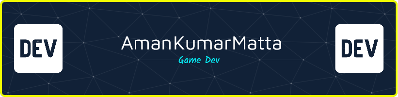

<!-- README.md - GitHub Profile -->

<h1 align="center">
  
</h1>

<p align="center">
  
</p>

---

### 🚀 About Me

```yaml
name: Aman
code: ["C#", "C++", "Python"]
specialties: ["Unity", "VR", "Hacking Stuff", "Making Chaos Fun 😈"]
currently_learning: ["Cybersecurity", "CI/CD", "Clean Code"]
fun_fact: "Once wrote a bug so sneaky, even the debugger gave up 😅"
